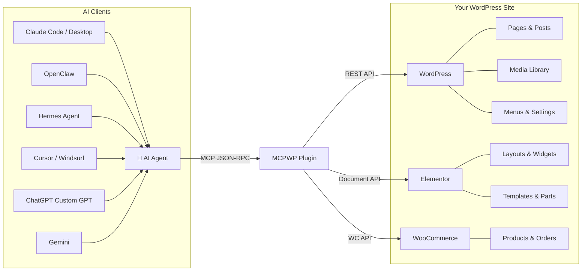
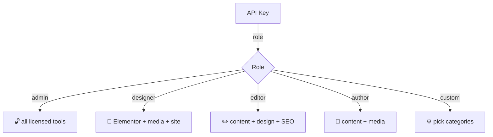

<p align="center">
  
</p>

<h1 align="center">MCPWP</h1>

<p align="center">
  <strong>WordPress MCP server. 120+ tools. Works with Claude, ChatGPT, OpenClaw, Hermes, Cursor, and any MCP client.</strong>
</p>

<p align="center">
  <a href="#install">Install</a> •
  <a href="#connect">Connect</a> •
  <a href="#tools">Tools</a> •
  <a href="#agency">Agency</a> •
  <a href="#blueprints">Blueprints</a> •
  <a href="https://mcpwp.net">Website</a>
</p>

<p align="center">
  <a href="https://github.com/Mumega-com/mcp-for-wp/stargazers"></a>
  <a href="https://github.com/Mumega-com/mcp-for-wp/releases"></a>
  
  
  
  
  
  
</p>

---

MCPWP turns any WordPress site into an MCP server. AI assistants manage site operations through natural language — pages, Elementor layouts, media, SEO, menus, approvals, analytics, and more. 120+ tools across 15+ categories, live-discovered on connect.

```
You: "Build a landing page with a hero, 3 feature cards, and a CTA"
AI:  wp_build_page → full Elementor page with styled sections, flex grid, shadows, hover effects
```

## How It Works



## Why MCPWP?

| | MCPWP | AI Engine (Meow) | WordPress MCP Adapter | InstaWP mcp-wp |
|---|---|---|---|---|
| **Tools** | **120+** | ~30 | ~15 | ~10 |
| **Elementor** | Full (build + edit + templates + theme) | No | No | No |
| **Agency proxy** | Multi-site (N clients, 1 token) | No | No | No |
| **Audit log + rollback** | Yes (EU AI Act ready) | No | No | No |
| **Site blueprints** | Yes (5 starters + custom) | No | No | No |
| **White-label** | Yes (agency branding) | No | No | No |
| **Site memory** | Persistent across sessions | No | No | No |
| **Proactive signals** | WordPress → AI alerts | No | No | No |
| **Approval workflow** | Request → approve → apply → rollback | No | No | No |
| **Role-scoped keys** | Yes | No | No | No |
| **OpenClaw skill** | Yes | Yes | No | No |
| **WooCommerce** | Yes | Yes | No | No |

## Install

```bash
wp plugin install https://mcpwp.net/download/mcpwp.zip --activate
```

Or download from [mcpwp.net](https://mcpwp.net) and upload via **WP Admin → Plugins → Add New**.

Generate an API key after activation: **WP Admin → MCPWP → Setup → Generate API Key**.

---

## Connect

### Claude Code / Claude Desktop

```json
{
  "mcpServers": {
    "mcpwp": {
      "url": "https://your-site.com/wp-json/mcpwp/v1/mcp",
      "headers": { "X-API-Key": "mcpwp_your_key_here" }
    }
  }
}
```

### OpenClaw

A pre-configured [ClawHub skill](integrations/clawhub/) is available:

```bash
openclaw skill install mcpwp
```

Or configure manually:

```bash
openclaw mcp add mcpwp \
  --url "https://your-site.com/wp-json/mcpwp/v1/mcp" \
  --transport streamable-http \
  --header "X-API-Key: mcpwp_your_key_here"
```

### Hermes Agent (Nous Research)

```json
{
  "mcp": {
    "servers": {
      "mcpwp": {
        "url": "https://your-site.com/wp-json/mcpwp/v1/mcp",
        "transport": "streamable-http",
        "headers": { "X-API-Key": "mcpwp_your_key_here" }
      }
    }
  }
}
```

Hermes auto-discovers all 120+ tools. With [Tool Search](https://hermes-agent.nousresearch.com/docs/user-guide/features/mcp) enabled, large tool catalogs see 25–50% accuracy gains on tool selection.

### Cursor / Windsurf / Zed

Add as a custom MCP server — same URL and key in your MCP settings.

### ChatGPT (Custom GPT)

Search **MCPWP** in the GPT Store for a pre-built WordPress Agent GPT. Enter your site URL and API key when prompted.

Or build your own using the [OpenAPI schema](integrations/chatgpt/openapi.yaml).

---

## Tools

MCPWP uses live tool discovery — the exact `tools/list` result adapts to active plugins, license plan, and API key scope. Always call `wp_onboard` first on a new connection — it returns a full site briefing with content inventory, active integrations, and recommended first actions.

| Category | Tools |
|----------|-------|
| **content** | Pages, posts, drafts, bulk ops, search, clone, template |
| **elementor** | Get/set full data, edit sections/widgets, patch, find-replace |
| **elementor-build** | Build pages from section blueprints |
| **elementor-templates** | Templates, archetypes, reusable parts |
| **elementor-theme** | Theme builder, conditions, custom code |
| **elementor-info** | Widget schemas, help, CSS regeneration |
| **site** | Menus, options, CSS, design refs, guides, workflows |
| **media** | Upload file/URL/base64, screenshot, AI alt text |
| **seo** | Audit, issues, autofix, search performance, structured data |
| **memory** | Persist brand rules and decisions across sessions |
| **blueprints** | Deploy starter sites, extract current structure |
| **approvals** | Request → approve → apply → rollback any change |
| **taxonomy** | Categories, tags, custom terms |
| **gutenberg** | Blocks, patterns, block types, serialize/parse |
| **webhooks** | Create, test, monitor event deliveries |
| **admin** | API keys, rate limits, settings, updates, analytics |
| **woocommerce** | Products, orders, categories (when WooCommerce active) |
| **learnpress** | Courses, lessons, quizzes (when LearnPress active) |

---

## Agency Features

MCPWP includes a multi-site agency stack for managing client sites at scale.

```
1 MCP token  →  N client WordPress sites
```

### Multi-Site Proxy

One Cloudflare Worker fronts all registered client sites. Claude (or any agent) lists sites and addresses them by domain:

```
wp_list_sites()
wp_get_page(_site: "client.com", id: 5)
wp_set_elementor(_site: "client.com", id: 5, elementor_data: [...])
```

### Audit Log + Rollback

Every MCP write logged to DB with timestamp, tool, args, before/after state snapshots. One-click rollback from Control Room. CSV export for compliance. Configurable log retention (default 90 days). EU AI Act enforcement deadline: August 2, 2026.

### White-Label

Agency branding in the WP admin: logo, colors, custom chat greeting. `[mcpwp_chat]` shortcode embeds a branded AI chat widget on any page or Elementor layout.

---

## Site Memory

AI decisions and brand rules persist across sessions in typed namespaces:

```
wp_remember(namespace: "brand", key: "tone", value: "professional, no jargon")
wp_recall(namespace: "brand", key: "tone")    →  "professional, no jargon"
wp_list_memories(namespace: "brand")
wp_forget(namespace: "brand", key: "tone")
```

Namespaces: `brand`, `design`, `seo`, `decisions`, `custom`.

---

## Proactive Signals

WordPress surfaces issues without being asked:

```
wp_get_signals() → [
  { severity: "high",   message: "3 pages have broken Elementor data" },
  { severity: "medium", message: "12 posts not updated in 6+ months" },
  { severity: "low",    message: "Plugin updates available: Elementor 3.26" }
]
```

Signal types: stale content, broken Elementor, missing featured images, draft accumulation, plugin updates, SEO issues.

---

## Site Blueprints

Deploy a full multi-page site structure from a starter, or snapshot your current site as a reusable blueprint.

**Starter blueprints:** law-firm, restaurant, saas, real-estate, portfolio

```
wp_deploy_site_blueprint(id: "saas")   →  creates all pages + nav menu
wp_extract_site_blueprint()            →  snapshot current site as a blueprint
wp_list_site_blueprints()              →  list starters + saved blueprints
wp_create_site_blueprint(name: "...")  →  save a custom blueprint
```

---

## Approval Workflow

Every write can go through a human gate:

```
wp_create_approval_request(tool: "wp_set_elementor", params: {...})
→ appears in Control Room for review
→ wp_apply_approval(id: 42)    applies the change
→ wp_rollback_approval(id: 42) undoes it
```

---

## Elementor

- **Section blueprints** — hero, features, cta, pricing, team, portfolio, services, 20+ more
- **Validation** — auto-fixes missing IDs, wrong widget keys, nesting errors
- **Fuzzy matching** — "headng" → "Did you mean 'heading'?"
- **Partial edits** — `wp_edit_widget`, `wp_edit_section`, `wp_patch_elementor`
- **CSS regeneration** — auto-rebuilds CSS, purges SiteGround/WP Rocket/LiteSpeed caches
- **Container + classic mode** — works with both Elementor layout modes

---

## Role-Scoped API Keys



Create keys via **WP Admin → MCPWP → Setup**, or `wp_create_api_key(label, role)`.

---

## Roadmap

### Shipped (v2.8.45–v2.8.49)
- [x] Server-side MCP tool analytics (PostHog, opt-in/opt-out)
- [x] Agency multi-site proxy (Cloudflare Worker, hybrid MCP routing)
- [x] AI action audit log + rollback (EU AI Act ready, Aug 2026)
- [x] Agency dashboard (health checks, request volume)
- [x] White-label branding + `[mcpwp_chat]` shortcode
- [x] Dynamic site memory (`wp_remember` / `wp_recall` / `wp_forget`)
- [x] Proactive signals (`wp_get_signals`)
- [x] Site blueprint library (5 starters, deploy + extract)
- [x] Chat excellence (multi-model: OpenAI GPT-4o mini, Gemini 2.5 Flash, Workers AI; SSE streaming; history)

### v2.9 — Multi-Client Distribution
- [ ] ChatGPT Custom GPT + curated OpenAPI schema (GPT Store)
- [ ] MCP Resources — WordPress content as browsable MCP resources
- [ ] MCP Prompts — reusable editorial + SEO workflow templates
- [ ] OpenClaw ClawHub skill + deep compatibility
- [ ] Hermes Agent integration guide + BM25-optimized tool descriptions

### v3.0 — Auth Layer
- [ ] OAuth 2.1 server (unlocks ChatGPT MCP Connector + Claude Connector directory)
- [ ] Claude Desktop Extension (MCPB format, per-user URL + API key)
- [ ] ChatGPT native MCP Connector (120+ tools, live tool discovery)

### v3.1 — Intelligence Layer
- [ ] Tool Search / deferred tool loading (BM25 retrieval over 120+ tools)
- [ ] Per-site custom tool registry (add tools without modifying the plugin)
- [ ] Multi-agent handoffs (SEO + content + deploy agents in sequence)

---

## Contributing

See [CONTRIBUTING.md](CONTRIBUTING.md) for setup and contribution guidelines.

## Security

See [SECURITY.md](SECURITY.md) for our vulnerability disclosure policy.

## Links

- **Website:** [mcpwp.net](https://mcpwp.net)
- **OpenClaw skill:** [integrations/clawhub/](integrations/clawhub/)
- **ChatGPT schema:** [integrations/chatgpt/](integrations/chatgpt/) *(coming in v2.9)*
- **WordPress.org:** pending approval
- **Download:** [mcpwp.net](https://mcpwp.net)

## License

GPL v2 or later. See [mcpwp.net](https://mcpwp.net) for current packaging, pricing, and plan terms.

---

<p align="center">
  Built by <a href="https://mumega.com">Mumega</a>
</p>
