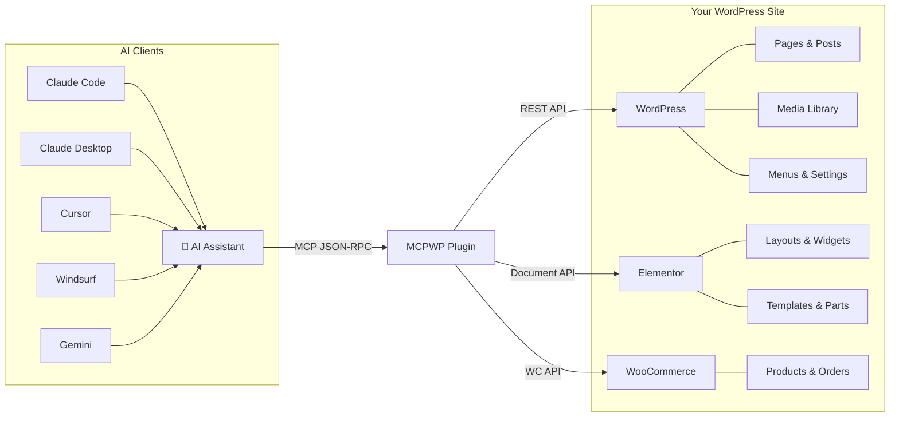
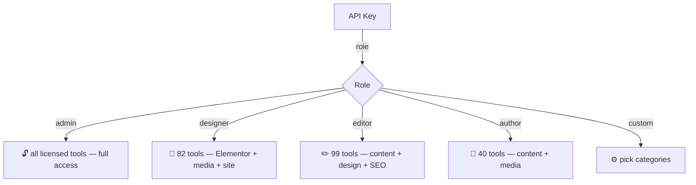

<h1 align="center">MCPWP</h1>

<p align="center">
  <strong>AI operations for WordPress through MCP. Built for agencies, builders, and site operators.</strong>
</p>

<p align="center">
  <a href="#install">Install</a> •
  <a href="#connect">Connect</a> •
  <a href="#tools">Tools</a> •
  <a href="#examples">Examples</a> •
  <a href="#pricing">Pricing</a> •
  <a href="https://mcpwp.net">Website</a>
</p>

<p align="center">
  <a href="https://github.com/Mumega-com/mcpwp/stargazers"></a>
  <a href="https://github.com/Mumega-com/mcpwp/releases"></a>
  <a href="https://www.npmjs.com/package/@mcpwp.net/mcpwp"></a>
  
  
  
  
  
</p>

---

MCPWP turns a WordPress site into an MCP server. AI assistants (Claude, Gemini, GPT, Cursor, Windsurf) can manage site operations through natural language — pages, Elementor layouts, WooCommerce products, media, SEO, menus, and more. Tool availability depends on the active plugins and the current license plan.

```
You: "Build a landing page with a hero, 3 feature cards, and a CTA"
AI:  wp_build_page → full Elementor page with styled sections, flex grid, shadows, hover effects
```


## How It Works



## Why MCPWP?

### What it lets you do

- **Build Elementor pages from a prompt** — hero, features, pricing, FAQs, testimonials — without touching the editor
- **Run SEO audits and apply fixes** with approval gates so agents can't publish without your sign-off
- **Manage WooCommerce products, orders, and categories** through natural language
- **Scope API keys by role** — give a designer access to Elementor only; give an author access to posts only
- **Validate and auto-fix Elementor data** — missing IDs, wrong widget keys, nesting errors caught before save
- **Operate from any MCP-compatible agent** — Claude Desktop, Claude Code, Cursor, Windsurf, ChatGPT, n8n, AWS AgentCore, and any client that speaks MCP

### Compared to alternatives

| | MCPWP | WordPress MCP Adapter | Royal MCP | InstaWP mcp-wp |
|---|---|---|---|---|
| **Approval gates** | ✓ | No | No | No |
| **Elementor** | Full (build + edit + templates) | No | No | No |
| **WooCommerce** | 21 tools | No | No | No |
| **Role-scoped keys** | 5 roles | No | No | No |
| **Blueprints** | 24 types | 0 | 0 | 0 |
| **Validation + auto-fix** | ✓ | No | No | No |
| **Install** | WordPress plugin | Requires Abilities API | WordPress plugin | External Node.js |
| **Commercial model** | Paid plans + trial | Free | Free | Free |

### Works with any agent runtime

MCPWP speaks standard MCP over HTTP — it does not require a specific agent or platform. Connect it to:

- **Claude Desktop / Claude Code** — `npx @mcpwp.net/mcpwp --setup`
- **Cursor / Windsurf / Zed** — paste the `mcpServers` config block
- **ChatGPT** — via the ChatGPT MCP connector
- **n8n / Zapier / Make** — use the MCP HTTP transport as a step
- **AWS AgentCore / Google Vertex** — any harness that supports MCP HTTP
- **Your own agent** — call `/wp-json/site-pilot-ai/v1/mcp` directly

The WordPress site is the governed system of record. The agent runtime is interchangeable.

## Install

```bash
wp plugin install https://mumega.com/spai-updates/mumega-site-pilot-ai-latest.zip --activate
```

Or download from [mcpwp.net](https://mcpwp.net) and upload via **WP Admin > Plugins > Add New > Upload Plugin**.

Free tier is available on WordPress.org. Pro and Agency plans at [mcpwp.net/pricing](https://mcpwp.net/pricing) — 14-day free trial, no credit card required.

## Connect

### npm — Claude Desktop / Cursor / Windsurf (recommended)

```bash
npx @mcpwp.net/mcpwp --setup
```

Prompts for your WordPress URL and API key, saves config, and prints the exact JSON to paste into your client.

**Claude Desktop** (`claude_desktop_config.json`):
```json
{
  "mcpServers": {
    "mcpwp": {
      "command": "npx",
      "args": ["-y", "@mcpwp.net/mcpwp"],
      "env": { "WP_URL": "https://your-site.com", "WP_API_KEY": "spai_..." }
    }
  }
}
```

**Claude Code** (`.mcp.json` in your project):
```json
{
  "mcpServers": {
    "wordpress": {
      "command": "npx",
      "args": ["-y", "@mcpwp.net/mcpwp"],
      "env": { "WP_URL": "https://your-site.com", "WP_API_KEY": "spai_..." }
    }
  }
}
```

### Streamable HTTP (direct, no npm)
```json
{
  "mcpServers": {
    "mcpwp": {
      "url": "https://your-site.com/wp-json/site-pilot-ai/v1/mcp",
      "headers": { "X-API-Key": "spai_your_key_here" }
    }
  }
}
```

### Claude Code Plugin
```bash
claude plugin marketplace add https://github.com/Mumega-com/mumcp-claude-plugin.git
claude plugin install mumcp@mumcp
```
Adds `/mumcp:setup`, `/mumcp:tools`, `/mumcp:elementor`, `/mumcp:design` skills + `wp-builder` agent.

## Tools

MCPWP exposes tools across 15 categories. The live count from `tools/list` varies by installed plugins, disabled categories, WP.org vs paid build, and API key scope — so no hardcoded number is published here.

| Category | Tools | What |
|----------|-------|------|
| **content** | 28 | Pages, posts, drafts, bulk ops, search |
| **elementor** | 12 | Get/set data, edit sections, edit widgets |
| **elementor-build** | 8 | Build pages from blueprints, landing pages |
| **elementor-templates** | 15 | Templates, archetypes, reusable parts |
| **elementor-theme** | 10 | Theme builder, conditions, custom code |
| **elementor-info** | 5 | Widget schemas, help, CSS regen |
| **site** | 37 | Menus, options, CSS, design refs, guides |
| **media** | 7 | Upload file/URL/base64, screenshot |
| **woocommerce** | 21 | Products, orders, categories, analytics |
| **learnpress** | 18 | Courses, lessons, quizzes, curriculum |
| **seo** | 10 | Meta tags, analysis, bulk SEO, indexing |
| **taxonomy** | 5 | Categories, tags, custom terms |
| **gutenberg** | 4 | Blocks, patterns, block types |
| **admin** | 16 | API keys, rate limits, settings, updates |
| **webhooks** | 7 | Create, test, monitor deliveries |

## Role-Scoped API Keys



Create keys via WP Admin > MCPWP > Setup, or `wp_create_api_key(label, role)`.

## Blueprints

Build full pages with one call. 24 section types:

| Type | What it builds |
|------|---------------|
| `hero` | Full-width hero with heading, CTA, background |
| `features` | Icon-box card grid with shadows, hover effects |
| `cta` | Call-to-action banner with button |
| `pricing` | Price table columns with feature lists |
| `faq` | Accordion with Q&A |
| `testimonials` | Quote cards with ratings |
| `team` | Team member cards with images |
| `portfolio` | Project showcase grid |
| `blog_grid` | Blog post cards |
| `services` | Service cards with pricing |
| `about` | Image + text side-by-side |
| `process_steps` | Numbered step cards |
| `social_proof` | Star ratings + quotes |
| `product_showcase` | Product highlight with features |
| `before_after` | Comparison columns |
| `newsletter` | Email signup CTA |
| `stats` | Animated number counters |
| `gallery` | Image gallery grid |
| `text` | Simple text section |
| `map` | Google Maps embed |
| `countdown` | Countdown timer |
| `logo_grid` | Partner/client logos |
| `video` | Video embed |
| `contact_form` | Contact form section |

## Examples

### Build a page
```
wp_build_page(title: "Services", sections: [
  {type: "hero", heading: "Our Services", button_text: "Get Started"},
  {type: "features", columns: 3, items: [
    {icon: "fas fa-rocket", title: "Fast", desc: "Speed matters"},
    {icon: "fas fa-shield-alt", title: "Secure", desc: "Bank-grade"},
    {icon: "fas fa-heart", title: "Reliable", desc: "99.9% uptime"}
  ]},
  {type: "cta", heading: "Ready?", button_text: "Contact Us"}
])
```

### Edit one widget
```
wp_edit_widget(page_id: 42, widget_id: "abc123", settings: {title_text: "New Title"})
```

### Upload an image
```
wp_upload_media_from_url(url: "https://example.com/photo.jpg", title: "Hero image")
```

### Manage WooCommerce
```
wc_create_product(name: "T-Shirt", regular_price: "29.99", type: "simple")
```

## Elementor Features

- **24 blueprint types** — hero, features, cta, pricing, team, portfolio, services, about, and more
- **Validation** — auto-fixes missing IDs, wrong widget keys, nesting errors
- **Fuzzy matching** — typo in widget type? "Did you mean 'heading'?"
- **Save persistence** — forces direct meta overwrite after Document::save()
- **CSS regeneration** — auto-rebuilds CSS, purges SiteGround/WP Rocket/LiteSpeed
- **Container + classic mode** — works with both Elementor layout modes

## Pricing

| Plan | Price | Sites | What's included |
|------|-------|-------|-----------------|
| **Free** | $0 | 1 | Core MCP, posts, pages, media, menus, basic Elementor, approval gates, activity log |
| **Pro** | $79/year | 1 | All free + SEO, WooCommerce, Elementor Pro, design references, archetypes, agent workflows, AI tools, Telegram, multi-site |
| **Agency** | $249/year | Unlimited | All Pro + agency dashboard, centralized key management |

14-day free trial on Pro. → [mcpwp.net/pricing](https://mcpwp.net/pricing)

## Roadmap

- [x] MCP tools across 15 categories (count varies by plugins + plan)
- [x] 24 page blueprints
- [x] Role-scoped API keys (5 roles)
- [x] Elementor validation + auto-fix
- [x] Admin UI (Setup, Library, Tools, Settings)
- [x] Claude Code plugin
- [x] npm package (`@mcpwp.net/mcpwp`)
- [x] MCP registry listing
- [x] Multi-site switching (`wp_switch_site` + `wp_list_sites`)
- [ ] WordPress.org listing (submission in progress)
- [ ] Agency dashboard
- [ ] 30+ blueprint types
- [ ] Visual diff — show what changed after MCP edits
- [ ] WooCommerce product page blueprints

## Contributing

See [CONTRIBUTING.md](CONTRIBUTING.md) for setup instructions and what we need help with.

## Security

See [SECURITY.md](SECURITY.md) for our vulnerability disclosure policy.

## Links

- **Website:** [mcpwp.net](https://mcpwp.net)
- **Claude Code Plugin:** [Mumega-com/mumcp-claude-plugin](https://github.com/Mumega-com/mumcp-claude-plugin)
- **MCP Proxy:** [Mumega-com/mumcp-proxy](https://github.com/Mumega-com/mumcp-proxy)
- **WordPress.org:** pending approval (slug: site-pilot-ai)
- **Download:** [mumega-site-pilot-ai-latest.zip](https://mumega.com/spai-updates/mumega-site-pilot-ai-latest.zip)

## License

GPL v2 or later. Paid plans and trials are managed through Freemius; check the product website for current pricing and plan terms.

---

<p align="center">
  Built by <a href="https://mumega.com">Mumega</a>
</p>
